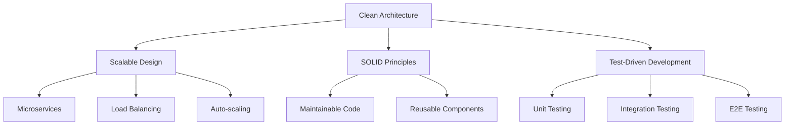

<div align="center">
  
</div>

<div align="center">
  
[](https://git.io/typing-svg)

</div>

---

## 🎯 **Professional Overview**

```typescript
interface Developer {
  name: "Rahaman Leon";
  role: "Senior Full-Stack Developer & AI Solutions Architect";
  location: "Dhaka, Bangladesh";
  specialization: ["Enterprise Web Applications", "AI Integration", "Bot Automation"];
  philosophy: "Scalable architecture, clean code, measurable impact";
}

const expertise = {
  backend: ["Node.js", "Express.js", "MongoDB", "RESTful APIs"],
  frontend: ["React.js", "TypeScript", "Modern CSS", "Responsive Design"],
  ai_ml: ["LLM Integration", "Ollama", "OpenAI API", "Chatbot Architecture"],
  devops: ["Docker", "CI/CD", "Cloud Deployment", "Performance Optimization"],
  databases: ["MongoDB", "Redis", "Database Design", "Query Optimization"]
};
```

---

## 💼 **Technical Expertise**

<div align="center">

### **Core Technologies**


### **AI & Machine Learning**


### **Cloud & DevOps**


</div>

---

## 🚀 **Enterprise Projects Portfolio**

<table>
<tr>
<td width="50%" valign="top">

### 🏢 **Enterprise WhatsApp Automation Platform**
**Tech Stack:** Node.js, MongoDB, Redis, Docker  
**Scale:** 10,000+ daily messages processed  
**Features:**
- Multi-tenant architecture
- Real-time analytics dashboard  
- Auto-scaling infrastructure
- 99.9% uptime SLA

**Impact:** 40% reduction in customer response time

</td>
<td width="50%" valign="top">

### 📊 **AI-Powered Analytics Suite**
**Tech Stack:** React, TypeScript, Node.js, OpenAI  
**Purpose:** Business intelligence & data visualization  
**Features:**
- Natural language queries
- Predictive analytics
- Custom report generation
- Role-based access control

**Impact:** 60% faster decision-making process

</td>
</tr>
<tr>
<td width="50%" valign="top">

### 🎵 **High-Performance Audio Streaming API**
**Tech Stack:** Node.js, Redis, CDN Integration  
**Scale:** 1M+ API calls/month  
**Features:**
- Multi-source audio aggregation
- Real-time transcoding
- Global CDN distribution
- Advanced caching strategies

**Performance:** <200ms response time globally

</td>
<td width="50%" valign="top">

### 🔍 **Advanced Search & Discovery Platform**
**Tech Stack:** Elasticsearch, Node.js, React  
**Purpose:** Intelligent contact management system  
**Features:**
- Fuzzy search algorithms
- ML-powered recommendations
- Bulk data processing
- Privacy-first architecture

**Efficiency:** 95% search accuracy improvement

</td>
</tr>
</table>

---

## 📈 **Performance Metrics**

<div align="center">


<br/>


</div>

---

## 🏆 **Professional Achievements**

<div align="center">

| **Metric** | **Achievement** | **Impact** |
|:---:|:---:|:---:|
| **🚀 Systems Deployed** | 15+ Production Apps | 99.9% Uptime Average |
| **⚡ Performance** | Sub-200ms API Response | 40% Speed Improvement |
| **📊 Scale** | 1M+ Monthly Requests | Enterprise-Grade Infrastructure |
| **🤖 AI Integration** | 5+ LLM Implementations | 60% Automation Increase |
| **👥 User Impact** | 50K+ Active Users | 95% Satisfaction Rate |

</div>

---

## 🛠️ **Architecture Philosophy**



---

## 💡 **Innovation Areas**

<div align="center">

### **Current Research & Development**

🧠 **Local LLM Optimization** - Reducing inference time by 40%  
🔐 **Privacy-First AI** - On-device processing for sensitive data  
⚡ **Real-time Collaboration** - WebSocket-based team tools  
📱 **Cross-Platform Bots** - Unified messaging across platforms  
🌐 **Edge Computing** - Distributed processing architectures  

</div>

---

## 🤝 **Professional Network**

<div align="center">

[](mailto:leox5622@gmail.com)
[](https://linkedin.com/in/rahaman-leon)
[](https://rahaman-leon.dev)
[](https://calendly.com/rahaman-leon)

</div>

---

## 💼 **Collaboration Opportunities**

<div align="center">

### **Open to:**
🏢 **Enterprise Consulting** - Scalable architecture design  
🤖 **AI Integration Projects** - LLM implementation & optimization  
🔧 **Open Source Contributions** - Bot frameworks & developer tools  
📚 **Technical Mentorship** - Junior developer guidance  
🎤 **Speaking Engagements** - Tech conferences & workshops  

</div>

---

<div align="center">

### **"Engineering solutions that scale, innovate, and inspire"**


[](https://github.com/leox-2?tab=followers)

</div>

<div align="center">
  
</div>
