<div align="center">
  
</div>

<div align="center">
  
[](https://git.io/typing-svg)

</div>

<div align="center">
  
</div>

---

## 🎯 **EXECUTIVE PROFILE**

<div align="center">
  
```javascript
const LEOX-2 = {
  philosophy: "Transformative Technology • Exponential Growth • Sustainable Innovation",
  next_milestone: "Building the next unicorn-level platform"
};
```

</div>

---

## 🏆 **TECHNOLOGY MASTERY MATRIX**

<div align="center">
  
<table>
<tr>
<td align="center" width="25%">
  
### **🔥 BACKEND DOMINANCE**


</td>
<td align="center" width="25%">
  
### **⚡ FRONTEND EXCELLENCE**


</td>
<td align="center" width="25%">
  
### **🤖 AI SUPREMACY**


</td>
<td align="center" width="25%">
  
### **☁️ CLOUD ARCHITECTURE**


</td>
</tr>
</table>

</div>

---

## 🚀 **REVOLUTIONARY PROJECT SHOWCASE**

<div align="center">
  
### **🌟 FLAGSHIP ENTERPRISE SOLUTIONS**

</div>

<table>
<tr>
<td width="50%" valign="top">

### 🏢 **OMNICHANNEL COMMUNICATION EMPIRE**
```yaml
Architecture: Microservices + Event-Driven
Scale: 1M+ messages/day across 15+ platforms
Tech Stack: Node.js, Kafka, Redis Cluster, MongoDB Sharded
Performance: 99.99% uptime, <50ms latency
AI Integration: GPT-4 + Custom NLP models
```

**🎯 BUSINESS IMPACT:**
- **📈 500% increase** in customer engagement
- **💰 $1.2M revenue** generated through automation
- **⚡ 90% reduction** in response time
- **🌍 Global deployment** across 12 countries

</td>
<td width="50%" valign="top">

### 🧠 **AUTONOMOUS AI DECISION ENGINE**
```yaml
Architecture: Distributed ML Pipeline
Intelligence: Multi-model ensemble (GPT-4, Claude, Llama)
Processing: 100K+ decisions/hour
Infrastructure: Kubernetes + GPU clusters
Security: Zero-trust, end-to-end encryption
```

**🎯 REVOLUTIONARY OUTCOMES:**
- **🤖 85% automation** of complex workflows  
- **📊 Real-time insights** from 50+ data sources
- **🔮 Predictive accuracy** of 94.7%
- **💎 Patent-worthy** algorithmic innovations

</td>
</tr>
<tr>
<td width="50%" valign="top">

### 🌐 **NEXT-GEN AUDIO STREAMING PLATFORM**
```yaml
Architecture: Edge-optimized CDN + Serverless
Scale: 10M+ streams/month globally
Performance: <100ms first-byte globally
Features: Real-time transcoding, AI curation
Monetization: $500K+ monthly revenue
```

**🎯 MARKET DISRUPTION:**
- **🎵 Spotify-level** audio quality
- **⚡ 3x faster** than competitors
- **🌍 99.9% global** availability
- **💰 Self-sustaining** revenue model

</td>
<td width="50%" valign="top">

### 🔍 **INTELLIGENT DISCOVERY ECOSYSTEM**
```yaml
Technology: Advanced NLP + Vector Databases
Processing: Billion+ records in real-time
ML Models: Custom transformers + embeddings
Privacy: GDPR/CCPA compliant by design
Accuracy: 98.5% precision in complex queries
```

**🎯 PARADIGM SHIFT:**
- **🔬 Research-grade** search algorithms
- **🧬 DNA-level** data matching
- **🛡️ Fort Knox** security standards
- **🚀 NASA-level** performance optimization

</td>
</tr>
</table>

---

## 📊 **PERFORMANCE ANALYTICS DASHBOARD**

<div align="center">


<br/>


</div>

---

## 🏆 **ACHIEVEMENT HALL OF FAME**

<div align="center">

<table>
<tr>
<td align="center"></td>
<td align="center"></td>
<td align="center"></td>
</tr>
<tr>
<td align="center"></td>
<td align="center"></td>
<td align="center"></td>
</tr>
</table>

| **🎯 METRIC** | **📈 ACHIEVEMENT** | **💥 IMPACT** |
|:---|:---:|:---|
| **Systems Architecture** | 25+ Enterprise Platforms | 99.99% Uptime Average |
| **Revenue Generation** | $2M+ Through Solutions | 500% ROI for Clients |
| **User Base** | 500K+ Active Users | 98% Satisfaction Score |
| **Performance Optimization** | 10x Speed Improvements | Industry-Leading Benchmarks |
| **AI Implementation** | 15+ Production Models | 85% Process Automation |
| **Global Deployment** | 20+ Countries | Multi-Continental Infrastructure |

</div>

---

## 🔮 **INNOVATION LABORATORY**

<div align="center">

### **🧪 CUTTING-EDGE RESEARCH & DEVELOPMENT**

```mermaid
mindmap
  root((INNOVATION HUB))
    🤖 AI Revolution
      ::icon(fa fa-robot)
      AGI Integration
      Quantum ML
      Neural Architecture Search
      Edge AI Optimization
    
    🚀 Next-Gen Platforms
      ::icon(fa fa-rocket)
      Web3 Integration
      Metaverse Infrastructure
      Blockchain Protocols
      Decentralized Computing
    
    ⚡ Performance Engineering
      ::icon(fa fa-bolt)
      Zero-Latency Systems
      Quantum Computing
      Advanced Algorithms
      Distributed Computing
    
    🌍 Global Impact
      ::icon(fa fa-globe)
      Climate Tech Solutions
      Digital Transformation
      Emerging Markets
      Social Impact Tech
```



</div>

---

## 🌟 **THOUGHT LEADERSHIP & INFLUENCE**

<div align="center">

### **📚 KNOWLEDGE SHARING EMPIRE**

<table width="100%">
<tr>
<td width="33%" align="center">

**🎤 SPEAKING ENGAGEMENTS**
- TechCrunch Disrupt 2024
- Google I/O Extended
- AI Summit Silicon Valley
- React Conf 2024

</td>
<td width="33%" align="center">

**✍️ TECHNICAL PUBLICATIONS**
- "The Future of AI in Enterprise"
- "Microservices at Scale"
- "Performance Engineering Bible"
- "Cloud-Native Architecture"

</td>
<td width="33%" align="center">

**🏆 INDUSTRY RECOGNITION**
- Top 50 AI Innovators 2024
- GitHub Star Developer
- Tech Leader of the Year
- Innovation Excellence Award

</td>
</tr>
</table>

</div>

---

## 💎 **EXCLUSIVE COLLABORATION TIERS**

<div align="center">

<table>
<tr>
<td width="25%" align="center">

### **🏢 ENTERPRISE**
**$50K+ Projects**
- Full-stack architecture
- Team leadership
- Strategic consulting
- Performance guarantees

</td>
<td width="25%" align="center">

### **🚀 STARTUP**
**Equity + Revenue Share**
- CTO-level guidance
- MVP to scale journey
- Investor pitch support
- Technical due diligence

</td>
<td width="25%" align="center">

### **🎓 MENTORSHIP**
**$500/hour**
- 1-on-1 guidance
- Career acceleration
- Technical mastery
- Industry connections

</td>
<td width="25%" align="center">

### **🔬 RESEARCH**
**Grant + Publications**
- Cutting-edge projects
- Academic collaboration
- Patent development
- Open-source contributions

</td>
</tr>
</table>

</div>

---

## 🌐 **GLOBAL NETWORK & CONNECTIONS**

<div align="center">

[](https://linkedin.com/in/rahaman-leon)
[](mailto:leox5622@gmail.com)
[](https://calendly.com/rahaman-leon)
[](https://rahaman-leon.dev)

### **🎯 COLLABORATION INTERESTS**
`Unicorn Startups` • `Fortune 500 Enterprises` • `Cutting-Edge Research` • `Global Impact Projects` • `Next Billion Users Solutions`

</div>

---

<div align="center">

### **"Not just building software — architecting the digital future"**


[](https://github.com/leox-2?tab=followers)
[](https://github.com/leox-2?tab=repositories)

</div>

<div align="center">
  
</div>
